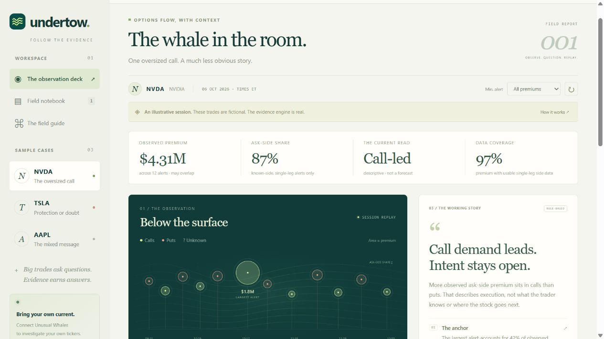
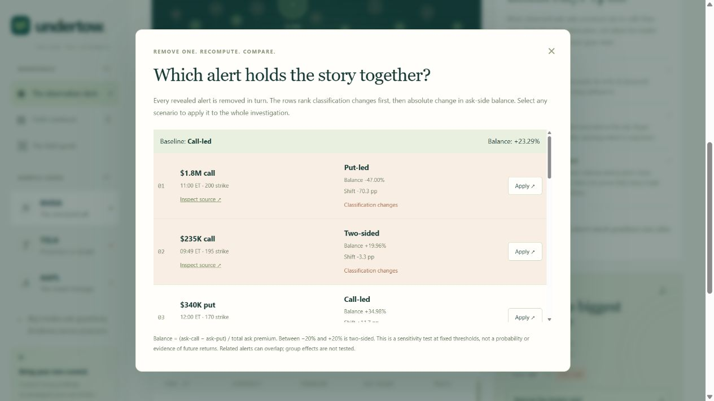
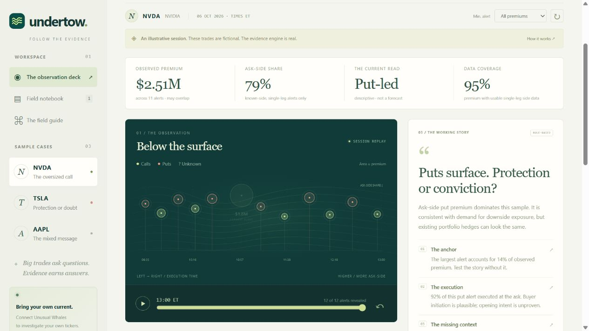
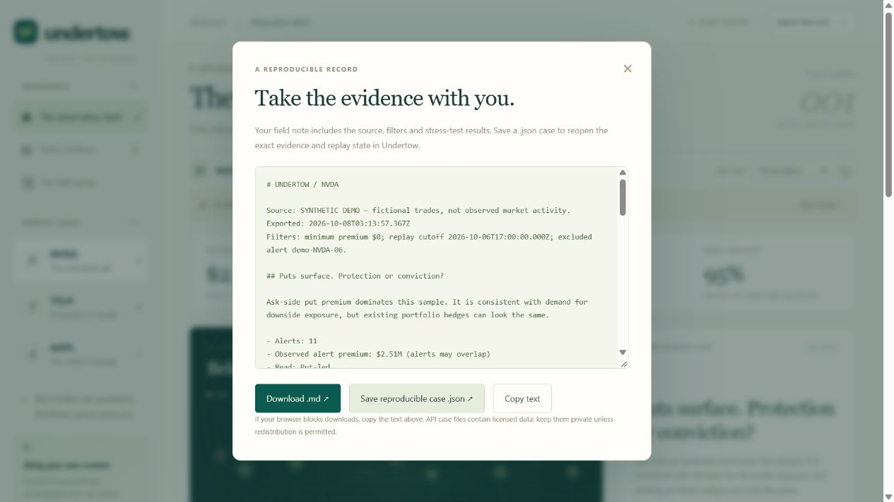
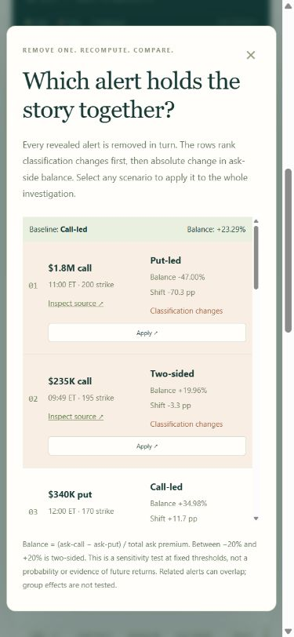

# Undertow — the working demo

**How much of your market story hangs on one alert?**

These screenshots were captured from the running app on 8 October 2026. All observations shown are deliberately fictional. They demonstrate working interactions, not real market activity or validated trading performance.

## 1. Follow the evidence

The synthetic NVDA case contains 12 alerts and $4.31M of observed alert premium. Its ask-side balance is +23.29%, giving the descriptive label Call-led.

## 2. Test every alert

The lab removes each revealed alert individually. Two removals change the label, for very different reasons: the $1.8M call reverses the balance by 70.3 percentage points, while a $235K call moves it only 3.3 points across the illustrative +20% threshold.

## 3. Apply the challenge

Remove the $1.8M call. The ledger and story now describe 11 alerts, $2.51M and a Put-led balance. Restore the evidence to undo the scenario.

## 4. Reproduce the investigation

Save a Markdown note for reading and a .json case for reconstruction. Reopening the case restores the same evidence, filter, replay position and excluded alert. Imported source labels are explicitly unverified.

The included [example case](examples/nvda-without-whale.json) was downloaded through this UI and reimported successfully during verification.

## A 90-second presentation

**0–15 seconds:** “One big options trade can dominate a story. Undertow asks whether the evidence survives without it.” Show the NVDA sample, with the fictional-data label visible.

**15–35 seconds:** “The first reading is Call-led. Every observation has its time, size and execution context.” Show the map and inspect the $1.8M call.

**35–55 seconds:** “Instead of cherry-picking a challenge, Undertow tests every alert. This whale reverses the reading. A smaller alert just crosses the threshold. The size of the effect matters.” Open the stress lab and show its first two rows.

**55–70 seconds:** Apply the whale-removal scenario. “The remaining sample is Put-led. This is a sensitivity check, not a forecast.”

**70–82 seconds:** “TSLA's sample stays Put-led in every individual removal. Stability still doesn't prove trader intent.” Switch to TSLA and show its stress summary.

**82–90 seconds:** Open export. “Save the evidence and reopen exactly the same investigation. A story you can question—and reproduce.”

## API validation

The stress lab also works at a 390-pixel mobile viewport:

The Unusual Whales adapter uses the documented Flow Alerts schema and is covered by mocked integration tests. A real authenticated request is still pending an API key. No runtime LLM or UW MCP connection is claimed.
